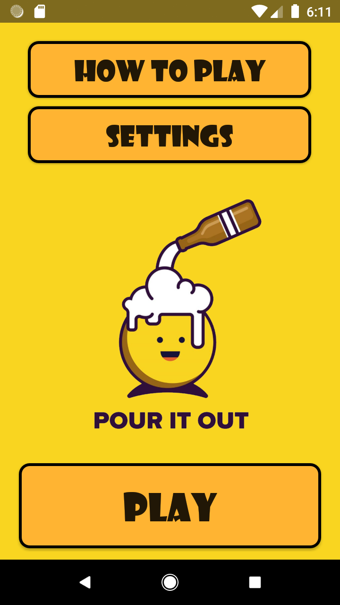
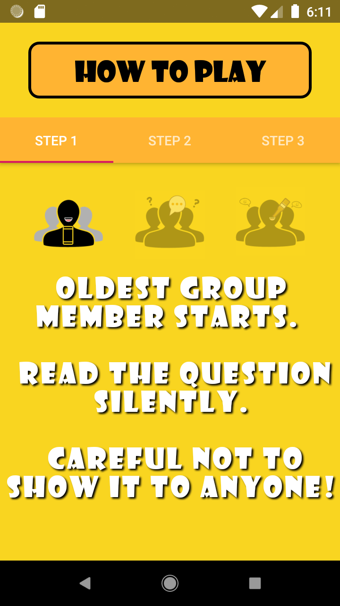
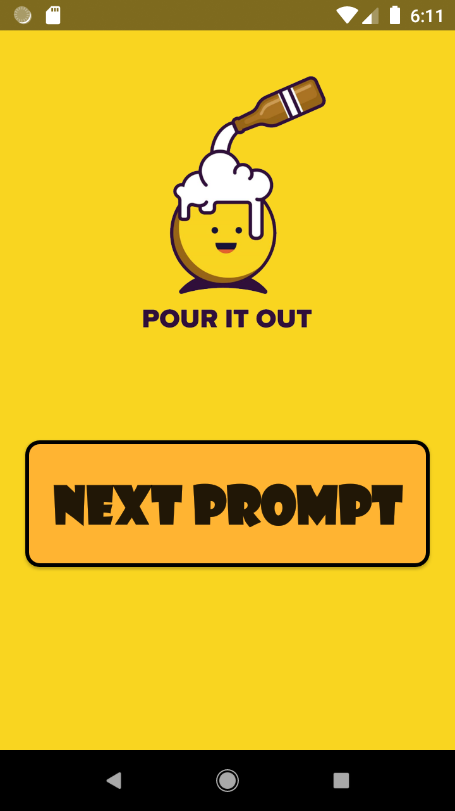
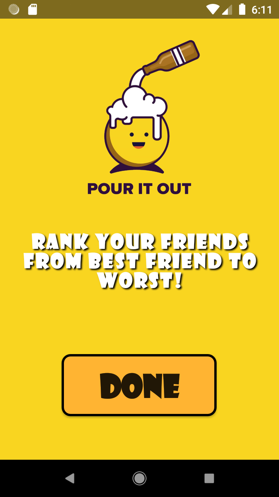

# Pour It Out (Without Source Code) - Kelvin Kwok

## Inspiration
Most drinking games requires you to read a question and answer OR take a sip of your drink. The idea of reversing the concept where answering the question is mandatory gives the people playing, a different feel and excitement. The concept of the game requires the participant to answer the question THEN they can either choose whether to reveal the question or NOT.

## UI Design
                                    

### Where can I find the source code?
The source code hasn't been included in this GitHub to protect intellectual property. If you wish to view the source code, send a request email to kelvin.k6633@gmail.com and your request will be processed shortly.

